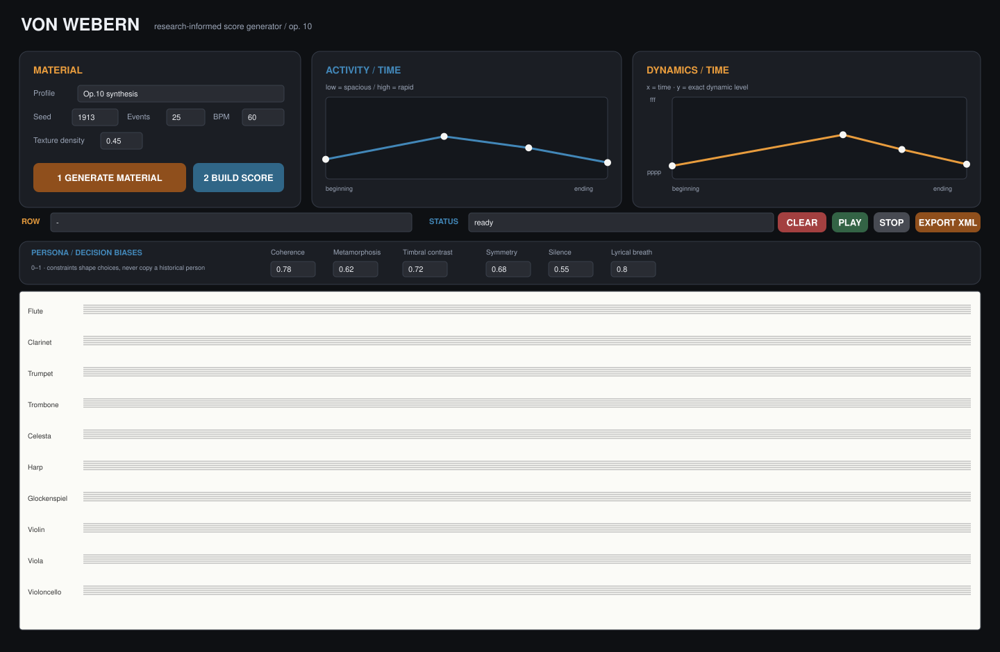

# Webern Persona Score

Самостоятельный инструмент для Max/MSP и `bach`, создающий
исследовательски обоснованный эскиз партитуры по материалам Антона Веберна и
аналитике Пяти пьес для оркестра op. 10.



## Результат

Патч выполняет полный цикл:

```text
случайный 12-тоновый ряд
→ высота, регистр, длительность и оркестровка
→ скрытый bach.roll
→ bach.quantize
→ десятистрочный bach.score
→ динамика, вилочки, штрихи, характер и подвижный темп
→ MusicXML
```

В рабочей версии больше нет старых `coll`, `urn`, разрозненных счётчиков,
абсолютных путей и нескольких несогласованных JavaScript-файлов. Вся
композиционная логика находится в одном движке; технический тракт
собран в компактном субпатче `p webern.core`.

## Требования

- Max 8.6 или новее;
- пакет `bach` 0.8.2.0 или новее; актуальная
  [версия 0.8.3](https://cycling74.com/packages/bach) рекомендуется.

Версия 4 использует новые имена патча и движка. Это намеренно исключает
ситуацию, когда Max находит одноимённый JavaScript из предыдущей сборки в
Search Path.

## Запуск

1. Открыть `max/WebernPersona.maxpat`. Патч сразу откроется в Presentation Mode.
2. Выбрать профиль, `Seed`, число событий, BPM, плотность и параметры Persona.
3. Нарисовать две кривые:
   - **Activity / Time**: низко — медленнее и просторнее, высоко — быстрее;
   - **Dynamics / Time**: слева направо идёт время, снизу вверх — точный
     диапазон `pppp → fff`.
4. Нажать **1 Generate Material**.
5. Нажать **2 Build Score**.
6. Проверить партитуру и нажать **Export XML**.

Каждое нажатие **Generate Material** создаёт новый ряд; `Seed` определяет
воспроизводимую последовательность генераций, а не навечно фиксирует один
результат. **Build Score** всегда заново читает обе кривые, создаёт свежий ряд
и материал, квантует его и лишь затем добавляет динамику, вилочки, штрихи,
текстовые ремарки и темп. Поэтому Build можно нажимать повторно даже без
предварительного Generate.

## Параметры

| Параметр | Назначение |
|---|---|
| Profile | Формальное поведение синтеза op. 10 или одной из пяти пьес |
| Seed | Полная воспроизводимость результата |
| Events | Общее число нотных событий, 1–240 |
| BPM | Темп, используемый и генератором, и `bach.quantize` |
| Texture density | Соотношение пауз, разреженности и перекрывающихся звучаний |
| Activity / Time | Длительности и межсобытийные интервалы по форме пьесы |
| Dynamics / Time | Глобальная драматургия: `x = время`, `y = pppp…fff`; профиль предлагает начальную кривую, пользователь имеет последнее слово |
| Coherence | Мотивная память, общие длительности и тембровые родства |
| Metamorphosis | Степень изменения возвращающейся идеи по тембру и регистру |
| Timbral contrast | Разделение семейств и полихромная несмешанность |
| Symmetry | Вероятность смещённого соответствия вокруг формальной оси |
| Silence | Вес пауз и разрывов между короткими группами |
| Lyrical breath | Протяжённость, внутреннее дыхание и динамическая пластика |

## Что означает «по-веберновски»

Генератор не утверждает, что реконструирует исторического человека. Он
реализует наблюдаемые композиционные тенденции:

- двенадцатитоновое исчерпание до повторения;
- ряд-кандидат оценивается по интервальному разнообразию и группам `3 × 4`;
- узкие хроматические и широкие диссонантные фигуры;
- центральные тоны и регистровые оси без функциональной тоники;
- смещённые симметрии вместо буквального зеркала;
- микро-фразы из `2–6` событий с временным солистом вместо независимых точек;
- пять фактурных режимов: соло-линия, передача мотива, эхо, краткий
  гоморитмический блок и многотембровая тремолирующая педаль;
- выбор инструмента по формальной роли, тембровому родству, контрасту,
  регистру, зеркальному партнёру и памяти недавних красок;
- отдельная комфортная полоса каждого инструмента; крайний регистр получает
  большой штраф и допускается главным образом у формальной оси/кульминации;
- описанные в исследованиях связи `флейта–челеста`, `арфа–струнные/медь`,
  `скрипка–глокеншпиль`, `кларнет–альт` как эвристические притяжения;
- несовпадение динамической, регистровой и событийной кульминаций;
- профильное угасание, внешний заключительный жест или возврат краски;
- артикуляция и техника зависят от функции: `staccatissimo`, акценты,
  portato, tremolo/trill, `Flatterzunge`, `col legno`, `mit Dämpfer`,
  `mit Schwammschlägel`;
- агогика оформляется реальными объектами темпа и ремарками `zögernd`,
  `a tempo`, `drängend`, `poco/molto rit.`, `rasch`, `Zeit lassen`;
- характер формулируют редкие функциональные указания `dolce`, `dolcissimo`,
  `espress.`, `molto espr.`, `deutlich`, `wie ein Hauch`, `sehr gebunden`.

| Профиль | Собственная физиономия |
|---|---|
| I | мягкое разреженное дыхание, сурдинные краски, `zögernd–a tempo`, ось и траектория `H/B → Gis/Ab → F` |
| II | более длинные фразы, `drängend`, всё больше общеритмических блоков, `pp → fff`, ускорение к `rasch` |
| III | очень медленное резонансное поле E, совмещённые тремоло/трели, `kaum hörbar`, угасание |
| IV | жест `вверх–вверх–вниз` и обращённый ответ, фон-продление, пауза-ось, `wie ein Hauch` |
| V | быстрый трёхчастный разгон, плотная вершина, затем `ruhig` и редкий эпилог с `d–es` |

Выбор профиля меняет BPM и обе исходные кривые в интерфейсе, а также размеры
фраз, вероятность синхронных групп, регистровый риск, педальные поля,
оркестровочные веса и план агогики. Кривую Dynamics после этого можно свободно
перерисовать во всём диапазоне `pppp–fff`.

`op. 10` исторически предшествует строгому додекафонному методу. Поэтому ряд
здесь служит пользовательским материалом и способом контролировать
двенадцатитоновое поле, а не доказательством серийной техники в оригинале.

Главное ограничение формулируется честно: это не «загрузка сознания» и не
статистический двойник человека. Persona — объяснимая система предпочтений,
памяти и редакторских запретов. Команда `trace` движка печатает в Max Console
причины выбора каждого инструмента.

`bach.score` 0.8.2/0.8.3 пока не предоставляет программного API для фразовых
slur. Поэтому версия 4 создаёт нативные длительности и ties через квантизацию,
группирует фразы одним инструментом, применяет `portato`/`sehr gebunden` и
экспортирует эти данные, но не рисует фиктивную фразировочную дугу, которую
невозможно надёжно сохранить в MusicXML. Это ограничение notation API, а не
скрытая опция патча.

## Структура проекта

```text
max/
  WebernPersona.maxpat             основной patch
  webernPersonaEngine.js           единое композиционное ядро
  webern_persona_profiles.json     шесть профилей и статус доказательности
docs/
  ARCHITECTURE_RU.md
  MAX_RUNTIME_CHECKLIST_RU.md
  WEBERN_PERSONA_PORTRAIT_RU.pdf
research/
  score/                 партитура op. 10
  texts/                 Ройтер, Холоповы, лекции Веберна
  notes/                 аналитическая модель и карта источников
tests/                   тестирование Max JavaScript без Max
tools/                   воспроизводимая сборка, проверка и XML-валидатор
```

Код и оригинальная документация проекта распространяются по MIT. Внешняя
партитура и исследовательские PDF сохраняют права своих издателей и авторов;
см. оговорку в `LICENSE` и `research/README.md`.

## Проверка

```sh
node tools/validate.js
node tools/check_musicxml.js path/to/export.musicxml
```

Первая команда заново собирает патч, проверяет весь граф соединений,
диапазоны, свежий ряд, микро-фразы, различие пяти пьес, педаль III, профили и
команды декорации. Вторая проверяет реальный экспорт на наличие партий, нот,
динамики и вилочек. Текст из annotation-slot 24 экспортируется как MusicXML
directions.
