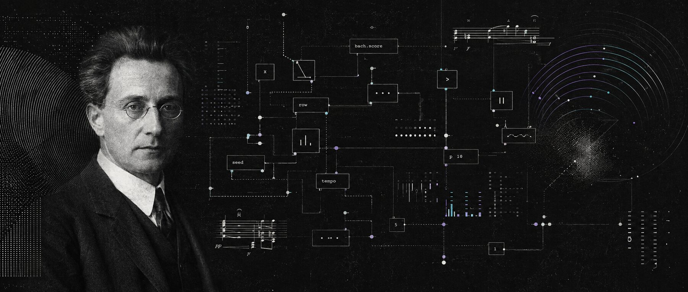

# Computational Modeling of Webern's *Op. 10*



**An analytical composition instrument for Max/MSP and bach**

Copyright (c) Dmitrii Shchukin 2026

This project translates observations about Anton Webern's *Five Pieces for
Orchestra*, op. 10 into a transparent, testable generative model. It creates a
ten-staff score whose pitch, register, rhythm, instrumental colour, articulation,
playing technique, dynamics and formal pacing are selected together rather than
as independent random parameters.

The result is not a style-transfer machine. It is a compositional laboratory:
every decision can be traced to a declared analytical rule or to an explicitly
identified heuristic.

## What the model listens for

The visible twelve-tone row is realized literally as the first aggregate.
Subsequent material is ranked through tone groups and pitch fields described in
Hans Peter Reutter's analysis: displaced symmetries, central and framing tones,
predominantly three-note groups, timbral correspondences, metric displacement
and movement-specific formal trajectories.

| Profile | Selection priorities |
| --- | --- |
| I — *Sehr ruhig und zart* | migration from B through A-flat to F; three-note groups; timbral palindrome and an external F close |
| II — *Lebhaft und zart bewegt* | G/A-flat frame, C axis, E-centred middle field, growth from contrapuntal lines toward chordal and trill textures |
| III — *Sehr langsam und äußerst ruhig* | A–D–A central path; quartal and minor-sixth fields; staggered resonant layers |
| IV — *Fließend, äußerst zart* | displaced G-sharp/A axis; related foreground and accompaniment colours; external D–E-flat frame |
| V — *Sehr fließend* | B/F and A/D centres; fourth-down/minor-third-up germ, characteristic semitone pairs, early culmination and sparse epilogue |

The pitch vocabulary is a priority system, not a collection of copied measures:
different seeds produce different scores while the analytical invariants remain
auditable.

## Use

Requirements:

- Max 8.6 or later;
- bach 0.8.2 or later.

Open `max/WebernPersona.maxpat`, select one of the six profiles, adjust the
controls and the **Activity / Time** and **Dynamics / Time** curves, then choose:

- **Generate Material** — create a new deterministic realization from the seed;
- **Build Score** — quantize and decorate the score;
- **Play / Stop** — audition it through the bundled MSP voice;
- **Export XML** — write MusicXML for further notation work.

To add standard multi-note phrase slurs after export:

```sh
node tools/add_phrase_slurs.js exported.musicxml
```

## Repository map

- `max/` — main patch, generative engine, profiles and audition voice;
- `research/notes/{english,deutsch,russian}/` — parallel analytical notes;
- `docs/` — architecture, project paper and visual material;
- `tools/` and `tests/` — reproducible builders and validation;
- `standalone/` — platform build sources and user guides on the
  `standalone-application` branch.

Run the complete static and generative validation suite:

```sh
node tools/validate.js
```

## Research basis

- Anton Webern, *Fünf Stücke für Orchester*, op. 10, Vienna: Universal Edition,
  UE 5067/12416, 1923.
- Anton Webern, *Der Weg zur neuen Musik*, ed. Willi Reich, Vienna: Universal
  Edition, 1960.
- Hans Peter Reutter, *Die Konzeption von Weberns freier Atonalität, dargestellt
  an den Orchesterstücken op. 10*, written study, Hochschule für Musik und
  Darstellende Kunst Frankfurt am Main.
- Valentina Kholopova and Yuri Kholopov, *Anton Webern: Zhizn' i tvorchestvo*,
  Moscow: Sovetskii kompozitor, 1984.
- Matthew Zeller, “Klangfarbenmelodie in 1911: Timbre's Functional Roles in
  Webern's Opp. 9 and 10,” *Music Theory Online* 28, no. 1 (2022),
  https://doi.org/10.30535/mto.28.1.9.

## Authorship and licence

The software, original analytical model, documentation and project identity are
the intellectual work of **Dmitrii Shchukin**. They are distributed under the
MIT License. Third-party scores and publications remain the property of their
respective rights holders and are not redistributed by this repository.

Citation metadata is provided in `CITATION.cff`.
